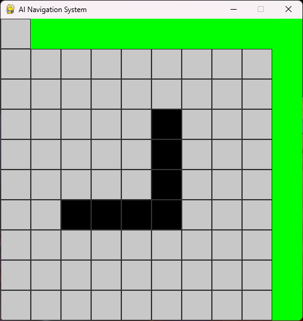

AI Autonomous Navigation System (Pathfinding + Simulation)

"Python" (https://img.shields.io/badge/Python-3.9-blue)
"Algorithm" (https://img.shields.io/badge/Algorithm-A*-yellow)
"Visualization" (https://img.shields.io/badge/Visualization-Matplotlib-orange)

Overview

An end-to-end AI-based project that simulates intelligent navigation using pathfinding algorithms and provides visual insights through grid-based environments.

Problem Statement

Efficient navigation is critical in systems such as:

• Autonomous robots
• Self-driving vehicles
• Game AI systems

Challenges include:

• Finding shortest path in complex environments
• Avoiding obstacles
• Optimizing movement efficiency

This project solves these problems using intelligent pathfinding algorithms.

Solution

The system uses a grid-based environment where:

• Nodes represent positions
• Obstacles are defined within the grid
• Start and goal positions are assigned

An A* (A-star) algorithm is implemented to compute:

• Shortest path
• Efficient traversal
• Optimal route selection

Key Features

• Implementation of A* pathfinding algorithm
• Grid-based environment simulation
• Shortest path computation
• Visualization of navigation path
• Modular and scalable code structure

Visualization Preview

Sample Output

• Input: Start = (0,0), Goal = (9,9)
• Output: Shortest path found avoiding obstacles

Tech Stack

• Python
• NumPy
• Matplotlib

Project Structure

AI-Autonomous-Navigation-System/
│
├── data/
├── outputs/
│   └── images/
├── notebooks/
├── docs/
├── src/
│
├── astar.py
├── grid.py
├── main.py
│
├── requirements.txt
└── README.md

How It Works

1. Grid environment is created
2. Obstacles are placed in the grid
3. A* algorithm is applied
4. Shortest path is calculated
5. Result is visualized or printed

How to Run

1. Clone Repository

git clone https://github.com/YOUR_USERNAME/AI-Autonomous-Navigation-System.git
cd AI-Autonomous-Navigation-System

2. Install Dependencies

pip install -r requirements.txt

3. Run Project

python src/main.py

Future Improvements

• Real-time navigation simulation
• Dynamic obstacle handling
• GUI-based interface
• Integration with robotics systems

Author

Nikhat Jahan
GitHub: https://github.com/Nikhatjahan85

